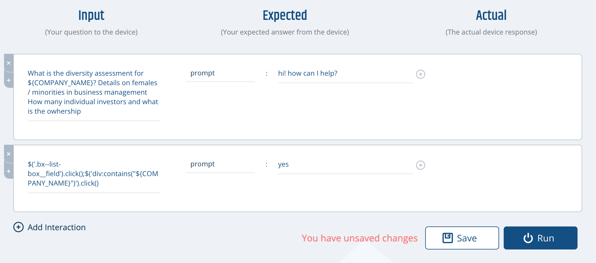
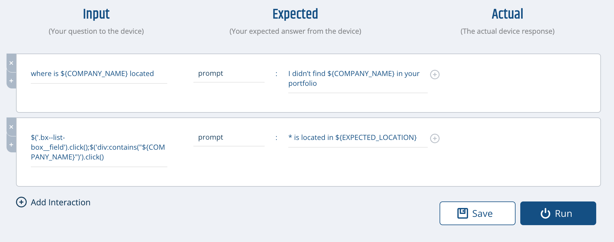

# Overview
This project demonstrates how to use the [Bespoken API](https://test-api.bespoken.io/api/docs/) to run templated tests in Python.

It requires Python3.

# Installation
## Setup dependencies
```
pip install -r
```

## Configure environment variables
Set the BESPOKEN_API_KEY as an environment variable:
```
export BESPOKEN_API_KEY=<API_KEY>
```

The API key can be found in the Dashboard via:
* Click on the three dots on the top right
* Select My Account
* Scroll down and the API key is on the bottom left

## Configure the tests to run
The tests to be run are set in the [TestRunner.py](./lib/TestRunner.py#97) file.

The test scenarios look like this:
```
TEST_SCENARIOS = [
    TestScenario('Dun and Bradstreet - Location', {
        'COMPANY_NAME': 'Pfizer',
        'EXPECTED_LOCATION': 'New York',
    }),
    TestScenario(
        'Dun And Bradstreet Template', {
        'COMPANY_NAME': 'Apple'
    }),
```

Each test scenario is composed of a test name and variables to be passed to it.

The templated test for diversity score inquiries look like this:



The templated test for location inquiries look like this:



In each case, the names of the variables in the test scenario code should match the variables in the test.

# Running the tests
Run the test with the command:
```
python3 ./lib/TestRunner.py 2
```

The last argument, 2, is the level of concurrency. We recommend keeping this at two for now, but let us know if you want to set it to a higher value.

The results will be viewable in the Dashboard. A summary of the results is also written as a CSV file to output/out.csv.

# Miscellaneous
## Location Question YAML (for importing to Dashboard)
```
---
- test : Test 1
- where is ${COMPANY_NAME} located :
  - prompt : "I didn’t find ${COMPANY_NAME} in your portfolio"
- $('.bx--list-box__field').click();$('div:contains("${COMPANY_NAME}")').click() :
  - prompt : "* is located in ${EXPECTED_LOCATION}"
```

## Diversity Question YAML (for importing to Dashboard)
```
---
- test : Test 1
- What is the diversity assessment for ${COMPANY_NAME}? Details on females / minorities in business management  How many individual investors and what is the owhership :
  - prompt : "I didn't find * in your portfolio"
- $('.bx--list-box__field').click();$('div:contains("${COMPANY_NAME}")').click() :
  - prompt : "yes"
```
